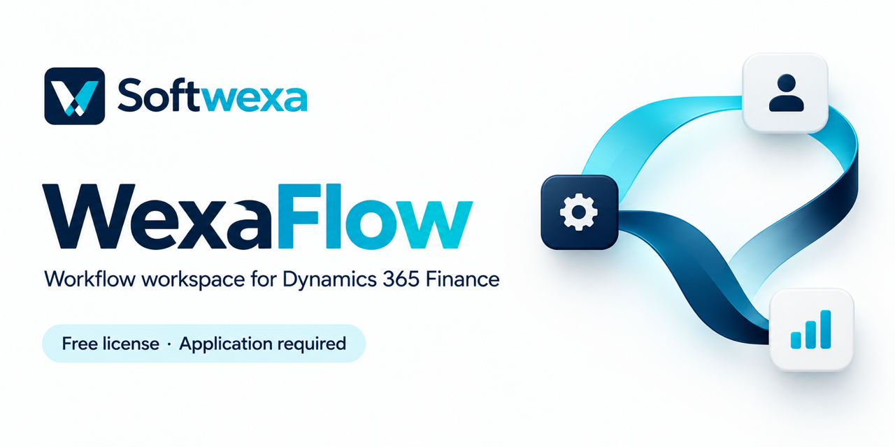

# WexaFlow for Microsoft Dynamics 365 Finance

A native **workflow workspace for Dynamics 365 Finance**, bringing flow configuration and data exploration into the Finance environment. WexaFlow helps D365 teams prepare business workflows and define the capabilities each process requires.

**[Apply for a Free license](https://www.softwexa.com/contact/?product=wexaflow&service=WexaFlow%20Free%20license%20application)** · [Product overview](https://www.softwexa.com/products/wexaflow/) · [Evaluation guide](https://www.softwexa.com/docs/wexaflow/) · [Request a demo](https://www.softwexa.com/demos/wexaflow/)

> **Free license application required.** Submit a request for WexaFlow. Softwexa reviews the application and confirms the product-specific tenant grant before access is activated.

## Prepare a workflow inside Finance

- **Native flow configuration:** prepare and review the structure of a business workflow.
- **Data exploration:** inspect the data fields and company context the process depends on.
- **Capability visibility:** review Free and premium scope for the issued product grant.
- **Integration planning:** identify the HTTP connections, jobs, schedules, triggers, email, files or hooks that require premium capabilities.
- **Scoped evaluation:** agree the nodes, permitted operations, sample data and failure scenarios before execution testing.

Start with one process: its initiating event, the data it needs and the expected result. The evaluation confirms which operations belong in the agreed package.

## Who is WexaFlow for?

| Team | Evaluation focus |
| --- | --- |
| Dynamics 365 teams | Prepare a flow in the native Finance workspace. |
| ERP consultants | Map process steps, access requirements and company context. |
| Integration teams | Identify external systems, premium capabilities and operational acceptance criteria. |

Describe a representative workflow, such as reviewing a customer-data handoff between two systems. Mapping, execution and error handling are agreed and tested for that specific scenario.

## Get started with a Free license

1. **[Submit your Free license application](https://www.softwexa.com/contact/?product=wexaflow&service=WexaFlow%20Free%20license%20application)** with your company, work email, Finance version and one workflow you want to evaluate.
2. **Confirm the product and tenant scope** with Softwexa, including the Free capabilities available for your evaluation.
3. **Receive the agreed package and setup guidance** after review, then validate the workspace and planned workflow in the agreed environment.

Use the [application guide and message template](./FREE-LICENSE.md) to prepare your request. Tenant registration, a repository clone or a demo request does not activate product access.

## Free and premium capabilities

| Scope | What is confirmed during review |
| --- | --- |
| **Free** | The WexaFlow workspace capabilities and limits included in the product-specific tenant grant. |
| **Premium** | HTTP integration, package jobs, schedules, triggers, email, files and hooks required by the proposed workflow. |

Flow, run, query, row, node and concurrency limits are defined by the issued grant. Tell us about the operations your process needs when applying.

**Product software is supplied separately under the agreed Softwexa licensing terms.** This repository publishes documentation and brand assets.

## Evaluation status

WexaFlow is in development evaluation. The native workspace and Free/premium capability distinction have been observed in an authenticated development session. End-to-end flow execution and premium integration acceptance are pending and must be completed for the agreed customer delivery.

See the [current evaluation and licensing guide](https://www.softwexa.com/docs/wexaflow/) before planning operational use.

## Resources and support

- [WexaFlow product page](https://www.softwexa.com/products/wexaflow/)
- [Evaluation and licensing documentation](https://www.softwexa.com/docs/wexaflow/)
- [Arrange a scoped demo](https://www.softwexa.com/demos/wexaflow/)
- [Product support](https://www.softwexa.com/support/?product=wexaflow#support-request)
- [WexaSQL data exploration workspace](https://github.com/softwexa/wexasql)

For license applications, use the private website form or **[hello@softwexa.com](mailto:hello@softwexa.com?subject=WexaFlow%20Free%20license%20application)**. For support, read [SUPPORT.md](./SUPPORT.md).

---

Built by **[Softwexa](https://www.softwexa.com)** — business software, Dynamics 365 Finance & Operations, X++ development and ERP integration.

[LinkedIn](https://www.linkedin.com/company/softwexa/) · [YouTube](https://www.youtube.com/@softwexa_com) · [X](https://x.com/softwexa_com)

